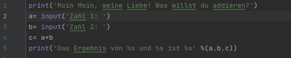
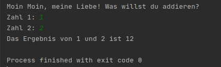

# Projekt 1.5: Ein kleiner Addierer

Die Schülerin R. versucht einen Taschenrechner, der ihr einfache Additionsaufgaben abnimmt, zu programmieren. 
So sieht der Quellcode aus:

Das Programm läuft fehlerfrei durch. Die Konsole gibt folgendes aus:

Die Schülerin weiß aber, dass 1+2 eigentlich 3 ergeben sollte.

Beantworten Sie folgende Fragen:
1. Wie musste R. den print Befehl verändern, so dass alle ihre Variablen mit im Text ausgegeben werden?
2. Warum lautet das Ergebnis für den Computer 12? Was hat der Computer getan?

-------------------

Aufgabe: 
1. Sie wollen nun selbst einen solchen Addierer programmieren. Schreiben Sie das Programm selbst! 
Bevor Sie das Ergbnis mit `print` ausgeben, geben Sie aber folgende Befehle ein:

`a = int(a)`

`b = int(b)` 
 
Funktioniert das Programm nun? Was haben die Befehle bewirkt?

2. Probieren Sie folgende Rechenaufgaben aus:
* 2589+42
* -1000+24
* -2147483648+10000000000000000000000000
* 565665465.456210+55555555.10
* 1.2+5,2           
**Achtung:** Im Englischen wird kein Komma sondern ein Punkt gesetzt, um "Nachkommastellen" abzutrennen. Dies sollte aus dem Englischunterricht bekannt sein!

Was denken Sie, ist das Problem, bei den letzten beiden Aufgaben?

Versuchen Sie nun statt `int(a)` und `int(b)` folgende Befehle:
* `float(a)` und `float(b)`

Welche Berechnungen funktionieren nun, welche funktionieren nicht?

**Sobald Sie alles ausprobiert haben, loggen Sie sich auf itslearning ein und füllen Sie den Fragebogen aus!**

Quelle
------
Diese Übungsaufgabe wurde von C. Driebe (Github: DerTopher) entworfen.